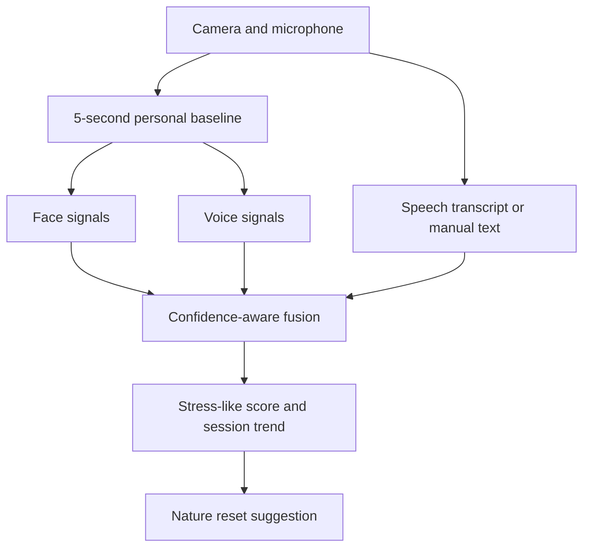

# CallCoach Live

CallCoach Live is a browser-based multimodal wellness observatory that estimates short-term stress-like changes from facial movement, vocal delivery, and language cues. When sustained high activation is detected, it can offer a guided nature reset with procedural visuals, ambient sound, and paced breathing.

> **Important:** CallCoach Live is an experimental wellness prototype. It is not a medical device, a mental-health assessment, a lie detector, or a diagnostic system. Its output should never be used to infer intent, competence, truthfulness, or a clinical condition.

## Live site

[Open CallCoach Live](https://callcoach-live.nowoohyun12.chatgpt.site/)

Access currently follows the site's hosting policy, so the deployment may require an approved account. A custom domain can be connected separately through the hosting settings and DNS provider.

## What it does

- Captures the camera and microphone only after explicit browser permission.
- Tracks one face in real time and derives tension-related signals from facial blendshapes.
- Measures vocal pitch, pitch variability, intensity, and approximate speaking rate.
- Transcribes English speech when the browser supports the Web Speech API.
- Accepts manual text when live transcription is unavailable or undesirable.
- Combines available modalities into a confidence-aware stress-like score from `0` to `100`.
- Smooths the score over time and records a rolling 60-second session history.
- Suggests a reset after sustained high activation when automatic prompts are enabled.
- Provides forest, ocean, and rain soundscapes with a `4��2��6` breathing rhythm.
- Exports the current session summary, transcript, and score samples as JSON.

## Multimodal analysis



### Face signal �� 40%

The browser loads MediaPipe Face Landmarker and analyzes a single face at roughly 10 frames per second. The prototype combines brow movement, eye tension, eye widening, jaw opening, lip pressure, frowning, and smiling. Facial measurements are compared with the short baseline collected at the start of the session.

### Voice signal �� 35%

The Web Audio API analyzes the microphone waveform locally. Autocorrelation estimates fundamental frequency, while a rolling window captures pitch variability. RMS energy provides an intensity estimate, and finalized transcript words provide an approximate words-per-minute value. The resulting score reflects changes in pitch, energy, variability, and pace relative to the baseline.

### Language signal �� 25%

The app combines the live English transcript with optional manual input. A lightweight lexical heuristic looks for pressure-related and calming terms, repeated punctuation, and cue density. This is intentionally transparent and should not be treated as a semantic or clinical language model.

### Fusion

For the set of currently available modalities $M$, the raw score is:

$$
S_{raw} = \frac{\sum_{i \in M} w_i S_i}{\sum_{i \in M} w_i}
$$

| Modality | Default weight | Example inputs |
| --- | ---: | --- |
| Face | 40% | Brows, eyes, jaw, lips, smile/frown |
| Voice | 35% | Pitch, variability, intensity, speaking rate |
| Language | 25% | Lexical pressure cues and punctuation |

Missing signals are excluded and the remaining weights are renormalized. The interface reports the sum of available default weights as fusion confidence. While a live session is running, exponential smoothing reduces sudden jumps:

$$
S_t = 0.82S_{t-1} + 0.18S_{raw}
$$

Scores are presented as observational ranges, not diagnoses:

- `0��39`: steady
- `40��69`: moderate
- `70��100`: high

## Guided intervention

If the fused score remains at or above `70` for more than six seconds, the app can suggest a reset. The intervention includes:

- procedural forest, ocean, or rain visuals;
- synthesized ambient audio generated with the Web Audio API;
- a five-minute timer;
- paced breathing: inhale for 4 seconds, hold for 2, and exhale for 6;
- manual environment and volume controls.

No external nature-video or audio file is required.

## Privacy and data flow

| Data | Processing | Persistence |
| --- | --- | --- |
| Camera frames | Processed in the browser by MediaPipe | Not stored by the app |
| Microphone waveform | Analyzed in the browser for acoustic features | Not stored by the app |
| Live transcript | Produced by the browser's speech-recognition service | Kept in the current tab unless exported |
| Manual text | Analyzed in the browser | Kept in the current tab unless exported |
| Session metrics | Calculated in browser memory | Downloaded only when the user selects **Export JSON** |

Browser speech recognition may send audio to the browser vendor or operating-system speech service. Its behavior and retention policy are outside this application's control. Use manual text or a browser without speech recognition if that is not acceptable.

## Technology

- React 19 and Next.js 16
- Vinext and Vite 8
- MediaPipe Tasks Vision
- WebRTC `getUserMedia`
- Web Audio API
- Web Speech API with manual-text fallback
- TypeScript and CSS
- Lucide React icons
- Cloudflare-compatible Sites runtime

## Run locally

### Prerequisites

- Node.js `22.13.0` or newer
- npm
- A modern browser with camera and microphone support
- A secure context (`localhost` or HTTPS) for media-device access

### Installation

```bash
git clone <your-repository-url>
cd callcoach-live
npm ci
npm run dev
```

Open the local URL printed by Vite, allow camera and microphone permissions, and select **Start multimodal session**. Look toward the camera and speak naturally during the five-second calibration.

The MediaPipe WASM bundle and face-landmarker model are loaded from external CDNs on first use, so the vision feature needs network access unless those assets are self-hosted.

## Available scripts

| Command | Purpose |
| --- | --- |
| `npm run dev` | Start the Vite/Vinext development server |
| `npm run build` | Build and validate the deployable artifact |
| `npm run start` | Start the built application |
| `npm test` | Build, validate, and run rendered-HTML checks |
| `npm run lint` | Run ESLint |
| `npm run validate:artifact` | Validate an existing deployment artifact |
| `npm run db:generate` | Generate optional Drizzle migrations |

## Project structure

```text
callcoach-live/
�쒋��� app/
��   �쒋��� globals.css       # Observatory UI, responsive layout, nature scenes
��   �쒋��� layout.tsx        # Document metadata and root layout
��   �붴��� page.tsx          # Capture, analysis, fusion, intervention, and export
�쒋��� public/               # Static assets
�쒋��� scripts/              # Install, build, and artifact-validation helpers
�쒋��� tests/                # Rendered application checks
�쒋��� worker/               # Cloudflare-compatible runtime entry
�쒋��� package.json
�붴��� README.md
```

## Browser notes

- Camera and microphone access normally require HTTPS outside `localhost`.
- Live transcription depends on `SpeechRecognition` or `webkitSpeechRecognition` and is not available in every browser.
- The transcript is configured for English (`en-US`). Manual text analysis remains available when transcription is unsupported.
- If the face model cannot load, voice and language analysis can continue.
- If speech is silent for several seconds, the stale voice signal is temporarily removed from fusion.
- Audio playback must begin after a user gesture because of browser autoplay policies.

## Known limitations

- The system uses engineered heuristics and a short personal baseline, not a clinically validated stress model.
- Lighting, camera angle, occlusion, microphone quality, room noise, accent, and speaking style can materially change results.
- Facial movement and vocal expression vary across culture, disability, neurotype, medication, age, and individual communication patterns.
- The language heuristic is English-focused and can misread quotations, jokes, domain-specific terms, negation, and context.
- A five-second baseline may be unstable and may already contain elevated activation.
- Fusion confidence describes signal availability, not scientific certainty or prediction accuracy.
- Session data exists only in the current browser tab unless the user exports it.

## Responsible use

Use CallCoach Live as a private reflection aid that helps a person notice patterns and choose a pause. Do not use it for employee scoring, hiring, education discipline, policing, insurance, healthcare decisions, surveillance, or any high-impact decision about another person. Always provide a clear opt-in, an easy stop control, and a non-camera/manual alternative.

## Possible next steps

- Add user-controlled calibration profiles stored locally.
- Replace lexical heuristics with an explicitly consented, tested on-device language model.
- Add multilingual transcription and language-specific cue sets.
- Visualize modality agreement and uncertainty over time.
- Add local-only session persistence and deletion controls.
- Self-host the MediaPipe runtime and model assets.
- Add accessibility testing, reduced-motion behavior, and keyboard-first intervention controls.
- Evaluate fairness, reliability, and test-retest stability with consented participants before any real-world study.

## License

No open-source license has been declared for this repository. Add an appropriate license before distributing or reusing the code outside the project.
